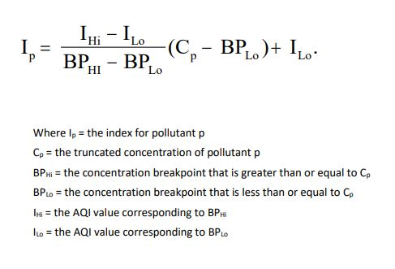

# AQI

The World Health Organization (WHO) has been investigating the impacts of different air compositions and their impact on human life for decades, publishing the  Air Quality Guidelines in 1987, and updating them regularly, setting a standard for what a desirable air quality human settlements all over the world should be striving for. 
For these studies, the following pollutants are investigated: particulate matter, ozone, nitrogen dioxide and sulfur dioxide, with all appearing under different forms everywhere in the world. 
AQIs (Air quality Indices) are values used by governmental organizations to quantify and evaluate air quality, making levels of pollution comparable even when the causes of the pollution themselves differ. Still, most of these values differ only slightly from the WHO standards,  showing an overall unified understanding of the air quality problematic.

The AQI setup and calculation method in the United States has values from 0 to 500, with 6 divisions corresponding to these descriptions: Good, Moderate, Unhealthy for Sensitive Groups, Unhealthy, Very Unhealthy and Hazardous, each color coded. These are meant to communicate air quality and possible dangers in a very simplified and comprehensive manner to the public. For each of these categories, there are different recommendations of behaviour (such as avoiding outdoor exertion) corresponding to certain risk groups as well as the overall population.

The calculation of the AQI takes place as follows; 

a. Identify the highest concentration among all of the monitors within each reporting area and truncate as follows: 
Ozone (ppm) – truncate to 3 decimal places
PM2.5 (µg/m3 ) – truncate to 1 decimal place 
PM10 (µg/m3 ) – truncate to integer 
CO (ppm) – truncate to 1 decimal place
SO2 (ppb) – truncate to integer 
NO2 (ppb) – truncate to integer

b. Using the AQI Breakpoint Table, find the two breakpoints that contain the concentration. 
c. Using the Equation, calculate the index. 
d. Round the index to the nearest integer.

## Credits

This project is imagined and created by Timo Bilhöfer, Markus Pfaff and Maria Rădulescu.

As part of the seminar *Learning Atmospheres* in the winter-semester 2020/21 it is supported by Irina Auernhammer, Silas Kalmbach and Prof. Lucio Blandini from the[ Institute for Lightweight Structures and Conceptual Design (**ILEK**)](https://www.ilek.uni-stuttgart.de/) and is also part of the[ Collaborative Research Centre 1244 (**SFB 1244**)](https://www.sfb1244.uni-stuttgart.de/).

## **Bibliography**

U.S. Environmental Protection Agency Office of Air Quality Planning and Standards Air Quality Assessment Division Research Triangle Park, NC, (2018):Technical Assistance Document for the Reporting of Daily Air Quality – the Air Quality Index (AQI) https://www.airnow.gov/sites/default/files/2020-05/aqi-technical-assistance-document-sept2018.pdf

World Health Organization (2006):Air quality guidelines. Global update 2005 : particulate matter, ozone, nitrogen dioxide, and sulfur dioxide. Copenhagen: World Health Organization.
